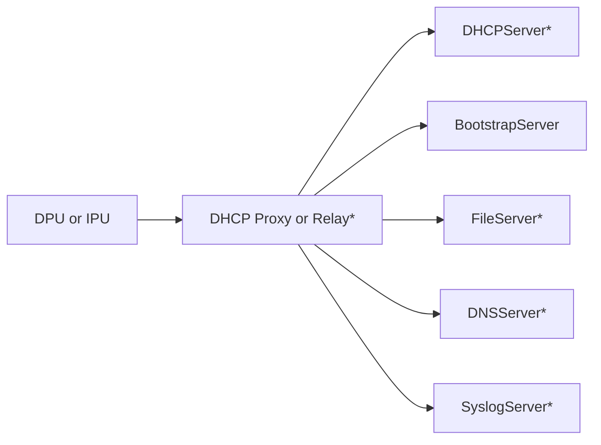
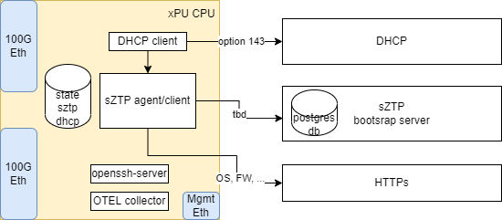

# Secure Zero Touch Provisioning (sZTP)

[](https://github.com/opiproject/sztp/actions/workflows/linters.yml)
[](https://github.com/opiproject/sztp/actions/workflows/codeql.yml)
[](https://securityscorecards.dev/viewer/?platform=github.com&org=opiproject&repo=sztp)
[](https://github.com/opiproject/sztp/actions/workflows/sztp.yml)
[](https://github.com/opiproject/sztp/actions/workflows/go.yml)
[](https://github.com/opiproject/sztp/blob/master/LICENSE)
[](https://codecov.io/gh/opiproject/sztp)
[](https://goreportcard.com/report/github.com/opiproject/sztp/sztp-agent)
[](http://godoc.org/github.com/opiproject/sztp/sztp-agent)
[](https://github.com/opiproject/sztp/releases)
[](https://github.com/opiproject/sztp)
[](https://github.com/opiproject/sztp/graphs/contributors)

## I Want To Contribute

This project welcomes contributions and suggestions.  We are happy to have the Community involved via submission of **Issues and Pull Requests** (with substantive content or even just fixes). We are hoping for the documents, test framework, etc. to become a community process with active engagement.  PRs can be reviewed by by any number of people, and a maintainer may accept.

See [CONTRIBUTING](https://github.com/opiproject/opi/blob/main/CONTRIBUTING.md) and [GitHub Basic Process](https://github.com/opiproject/opi/blob/main/doc-github-rules.md) for more details.

## Docs

* [RFC 8572](https://www.rfc-editor.org/rfc/pdfrfc/rfc8572.txt.pdf)
* [Watsen SZTPD](https://watsen.net/docs/sztpd/0.0.11/admin-guide/#simulator)
* [cizsle | Cisco ZTP Server](https://pypi.org/project/cizsle)
* [Juniper](https://www.juniper.net/documentation/us/en/software/junos/junos-install-upgrade/topics/concept/secure-ztp-understanding.html)
* [Cisco](https://gestaltit.com/events/sulagna/secure-zero-touch-provisioning-with-ciscos-implementation-on-ios-xr)
* [Nokia](https://infocenter.nokia.com/public/7750SR2110R1A/index.jsp?topic=%2Fcom.nokia.Basic_System_Configuration_Guide_21.10.R1%2Fsecure_ztp.html)

## Videos

* [Cisco Secure Zero-Touch with IOS XR](https://www.youtube.com/watch?v=rl2ucWoTqyg)

## How SZTP works

[See all the details here](./ZTP.md)



## sZTP on DPU Diagram



## Aliases

:exclamation: `docker-compose` is deprecated. For details, see [Migrate to Compose V2](https://docs.docker.com/compose/migrate/).

```text
command -v docker-compose || { shopt -s expand_aliases && alias docker-compose='docker compose'; }
```

## Before start

Change in `docker-compose.yml` file those settings per your lab:

```text
      NODE_IP_SUBNET: 10.127.127.0
      NODE_IP_NETMASK: 255.255.255.0
      NODE_IP_RANGE_MIN: 10.127.127.100
      NODE_IP_RANGE_MAX: 10.127.127.253
      NODE_IP_ADDRESS: 10.127.127.3
```

## Run everything

```text
docker-compose down --volumes --remove-orphans
docker-compose up --build --force-recreate
```

## Test everything

```text
./scripts/tests.sh
```

## Run sZTP (Bootstrap) Server only

```text
docker-compose up --build bootstrap
```

## Test sZTP (Bootstrap) Server only

Fetching Host-meta

```text
$ docker-compose run --rm -T agent curl -i --fail -H Accept:application/yang-data+json http://bootstrap:1080/.well-known/host-meta
HTTP/1.1 200 OK
Content-Type: application/xrd+xml; charset=utf-8
Content-Length: 104
Date: Wed, 17 Aug 2022 00:29:54 GMT
Server: <redacted>

<XRD xmlns="http://docs.oasis-open.org/ns/xri/xrd-1.0">
  <Link rel="restconf" href="/restconf"/>
</XRD>
```

Fetching the RESTCONF Root Resource

```text
$ docker-compose run --rm -T agent curl -i --fail -H Accept:application/yang-data+json http://bootstrap:1080/restconf/
HTTP/1.1 200 OK
Content-Type: application/yang-data+json; charset=utf-8
Content-Length: 137
Date: Wed, 17 Aug 2022 00:30:32 GMT
Server: <redacted>

{
    "ietf-restconf:restconf" : {
        "data" : {},
        "operations" : {},
        "yang-library-version" : "2019-01-04"
    }
}
```

Get the Current (Default) Configuration

```text
$ docker-compose run --rm -T agent curl -i -H "Accept:application/yang-data+json" http://bootstrap:1080/restconf/ds/ietf-datastores:running
HTTP/1.1 200 OK
Content-Type: application/yang-data+json; charset=utf-8
Content-Length: 318
Date: Wed, 17 Aug 2022 00:24:47 GMT
Server: <redacted>

{
  "wn-sztpd-1:transport": {
    "listen": {
      "endpoint": [
        {
          "name": "default startup endpoint",
          "use-for": "native-interface",
          "http": {
            "tcp-server-parameters": {
              "local-address": "0.0.0.0"
            }
          }
        }
      ]
    }
  }
}
```

## Device Getting Onboarding Information

Read the configuration back and validate it is correct:

```text
docker-compose exec bootstrap curl -i --user my-admin@example.com:my-secret -H "Accept:application/yang-data+json" http://bootstrap:1080/restconf/ds/ietf-datastores:running
```

Get onboarding info (from device perspective)

```text
$ docker-compose exec -T agent curl -X POST --data '{"ietf-sztp-bootstrap-server:input":{"hw-model":"model-x","os-name":"vendor-os","os-version":"17.3R2.1","signed-data-preferred":[null],"nonce":"BASE64VALUE="}}' -H Content-Type:application/yang-data+json --user opi-serial-number:my-secret --key /private_key.pem --cert /my_cert.pem --cacert /opi.pem https://bootstrap:9090/restconf/operations/ietf-sztp-bootstrap-server:get-bootstrapping-data  | tee /tmp/post_rpc_input.json
{
  "ietf-sztp-bootstrap-server:output": {
    "conveyed-information": "MIIDfwYLKoZIhvcNAQkQASugggNuBIIDansKICAiaWV0Zi1zenRwLWNvbnZleWVkLWluZm86b25ib2FyZGluZy1pbmZvcm1hdGlvbiI6IHsKICAgICJib290LWltYWdlIjogewogICAgICAiZG93bmxvYWQtdXJpIjogWwogICAgICAgICJodHRwOi8vd2ViOjgwODIvdmFyL2xpYi9taXNjL215LWJvb3QtaW1hZ2UuaW1nIiwKICAgICAgICAiZnRwOi8vd2ViOjMwODIvdmFyL2xpYi9taXNjL215LWJvb3QtaW1hZ2UuaW1nIgogICAgICBdLAogICAgICAiaW1hZ2UtdmVyaWZpY2F0aW9uIjogWwogICAgICAgIHsKICAgICAgICAgICJoYXNoLWFsZ29yaXRobSI6ICJpZXRmLXN6dHAtY29udmV5ZWQtaW5mbzpzaGEtMjU2IiwKICAgICAgICAgICJoYXNoLXZhbHVlIjogIjdiOmNhOmU2OmFjOjIzOjA2OmQ4Ojc5OjA2OjhjOmFjOjAzOjgwOmUyOjE2OjQ0OjdlOjQwOjZhOjY1OmZhOmQ0OjY5OjYxOjZlOjA1OmNlOmY1Ojg3OmRjOjJiOjk3IgogICAgICAgIH0KICAgICAgXQogICAgfSwKICAgICJwcmUtY29uZmlndXJhdGlvbi1zY3JpcHQiOiAiSXlFdlltbHVMMkpoYzJnS1pXTm9ieUFpYVc1emFXUmxJSFJvWlNCd2NtVXRZMjl1Wm1sbmRYSmhkR2x2YmkxelkzSnBjSFF1TGk0aUNnPT0iLAogICAgImNvbmZpZ3VyYXRpb24taGFuZGxpbmciOiAibWVyZ2UiLAogICAgImNvbmZpZ3VyYXRpb24iOiAiUEhSdmNDQjRiV3h1Y3owaWFIUjBjSE02TDJWNFlXMXdiR1V1WTI5dEwyTnZibVpwWnlJK0NpQWdQR0Z1ZVMxNGJXd3RZMjl1ZEdWdWRDMXZhMkY1THo0S1BDOTBiM0ErQ2c9PSIsCiAgICAicG9zdC1jb25maWd1cmF0aW9uLXNjcmlwdCI6ICJJeUV2WW1sdUwySmhjMmdLWldOb2J5QWlhVzV6YVdSbElIUm9aU0J3YjNOMExXTnZibVpwWjNWeVlYUnBiMjR0YzJOeWFYQjBMaTR1SWdvPSIKICB9Cn0="
  }
}
```

Decode payload

```text
$ jq -r .\"ietf-sztp-bootstrap-server:output\".\"conveyed-information\" /tmp/post_rpc_input.json | base64 --decode | tail -n +2 | sed  '1i {' | jq . | tee /tmp/post_rpc_fixed.json
{
  "ietf-sztp-conveyed-info:onboarding-information": {
    "boot-image": {
      "download-uri": [
        "https://web:443/my-boot-image.img",
        "ftps://web:990/my-boot-image.img"
      ],
      "image-verification": [
        {
          "hash-algorithm": "ietf-sztp-conveyed-info:sha-256",
          "hash-value": "7b:ca:e6:ac:23:06:d8:79:06:8c:ac:03:80:e2:16:44:7e:40:6a:65:fa:d4:69:61:6e:05:ce:f5:87:dc:2b:97"
        }
      ]
    },
    "pre-configuration-script": "IyEvYmluL2Jhc2gKZWNobyAiaW5zaWRlIHRoZSBwcmUtY29uZmlndXJhdGlvbi1zY3JpcHQuLi4iCg==",
    "configuration-handling": "merge",
    "configuration": "PHRvcCB4bWxucz0iaHR0cHM6L2V4YW1wbGUuY29tL2NvbmZpZyI+CiAgPGFueS14bWwtY29udGVudC1va2F5Lz4KPC90b3A+Cg==",
    "post-configuration-script": "IyEvYmluL2Jhc2gKZWNobyAiaW5zaWRlIHRoZSBwb3N0LWNvbmZpZ3VyYXRpb24tc2NyaXB0Li4uIgo="
  }
}
```

View the Audit Log

```text
$ docker-compose exec bootstrap curl -i -X GET --user my-admin@example.com:my-secret  -H "Accept:application/yang-data+json" http://bootstrap:1080/restconf/ds/ietf-datastores:operational/wn-sztpd-1:audit-log

HTTP/1.1 200 OK
Content-Type: application/yang-data+json; charset=utf-8
Content-Length: 648
Date: Wed, 17 Aug 2022 19:35:34 GMT
Server: <redacted>

{
  "wn-sztpd-1:audit-log": {
    "log-entry": [
      {
        "timestamp": "2022-08-17T19:35:22Z",
        "source-ip": "10.127.127.3",
        "host": "bootstrap:9090",
        "method": "POST",
        "path": "/restconf/operations/ietf-sztp-bootstrap-server:get-bootstrapping-data",
        "outcome": "success"
      }
    ]
  }
}
```

View the Bootstrapping Log

```text
$ docker-compose exec bootstrap curl -i -X GET --user my-admin@example.com:my-secret  -H "Accept:application/yang-data+json" http://bootstrap:1080/restconf/ds/ietf-datastores:operational/wn-sztpd-1:devices/device=opi-serial-number/bootstrapping-log
HTTP/1.1 200 OK
Content-Type: application/yang-data+json; charset=utf-8
Content-Length: 1034
Date: Wed, 24 Aug 2022 18:48:48 GMT
Server: <redacted>

{
  "wn-sztpd-1:bootstrapping-log": {
    "log-entry": [
      {
        "timestamp": "2022-08-24T18:47:54Z",
        "source-ip": "10.127.127.3",
        "method": "POST",
        "path": "/restconf/operations/ietf-sztp-bootstrap-server:get-bootstrapping-data",
        "return-code": 200,
        "event-details": {
          "get-bootstrapping-data-event": {
            "passed-input": {
              "hw-model": "model-x",
              "os-name": "vendor-os",
              "os-version": "17.3R2.1",
              "signed-data-preferred": [
                null
              ],
              "nonce": "BASE64VALUE="
            },
            "selected-response": "catch-all-response",
            "response-details": {
              "managed-response": {
                "conveyed-information": {
                  "onboarding-information": {
                    "referenced-definition": "my-onboarding-information"
                  }
                }
              }
            }
          }
        }
      }
    ]
  }
}
```

Download the image and scripts

```text
$ jq -r .\"ietf-sztp-conveyed-info:onboarding-information\".\"configuration\" /tmp/post_rpc_fixed.json | base64 --decode
<top xmlns="https:/example.com/config">
  <any-xml-content-okay/>
</top>

$ jq -r .\"ietf-sztp-conveyed-info:onboarding-information\".\"pre-configuration-script\" /tmp/post_rpc_fixed.json | base64 --decode
#!/bin/bash
echo "inside the pre-configuration-script..."

$ jq -r .\"ietf-sztp-conveyed-info:onboarding-information\".\"post-configuration-script\" /tmp/post_rpc_fixed.json | base64 --decode
#!/bin/bash
echo "inside the post-configuration-script..."

$ jq -r .\"ietf-sztp-conveyed-info:onboarding-information\".\"boot-image\".\"download-uri\"[] /tmp/post_rpc_fixed.json
https://web:443/my-boot-image.img
ftps://web:990/my-boot-image.img

$ jq -r .\"ietf-sztp-conveyed-info:onboarding-information\".\"boot-image\".\"image-verification\"[] /tmp/post_rpc_fixed.json
{
  "hash-algorithm": "ietf-sztp-conveyed-info:sha-256",
  "hash-value": "7b:ca:e6:ac:23:06:d8:79:06:8c:ac:03:80:e2:16:44:7e:40:6a:65:fa:d4:69:61:6e:05:ce:f5:87:dc:2b:97"
}

$ URL=$(jq -r .\"ietf-sztp-conveyed-info:onboarding-information\".\"boot-image\".\"download-uri\"[] /tmp/post_rpc_fixed.json)
$ docker-compose run --rm -v /tmp:/tmp agent curl --output /tmp/$(basename ${URL}) --fail ${URL}
Creating sztp_agent_run ... done
  % Total    % Received % Xferd  Average Speed   Time    Time     Time  Current
                                 Dload  Upload   Total   Spent    Left  Speed
100 65536  100 65536    0     0  31.2M      0 --:--:-- --:--:-- --:--:-- 31.2M

$ openssl dgst -sha256 -c /tmp/$(basename ${URL})
SHA256(/tmp/my-boot-image.img)= 7b:ca:e6:ac:23:06:d8:79:06:8c:ac:03:80:e2:16:44:7e:40:6a:65:fa:d4:69:61:6e:05:ce:f5:87:dc:2b:97

# Validate signature

$ SIGNATURE=$(openssl dgst -sha256 -c /tmp/$(basename ${URL}) | awk '{print $2}')
$ jq -r .\"ietf-sztp-conveyed-info:onboarding-information\".\"boot-image\".\"image-verification\"[] /tmp/post_rpc_fixed.json | grep $SIGNATURE
  "hash-value": "7b:ca:e6:ac:23:06:d8:79:06:8c:ac:03:80:e2:16:44:7e:40:6a:65:fa:d4:69:61:6e:05:ce:f5:87:dc:2b:97"
```

## Run DHCP server only

```text
docker-compose up --build dhcp
```

## Test DHCP server with NMAP

```text
$ docker-compose run --rm -T nmap
Creating sztp_nmap_run ... done
Starting Nmap 7.92 ( https://nmap.org ) at 2022-08-15 19:13 UTC
Pre-scan script results:
| broadcast-dhcp-discover:
|   Response 1 of 1:
|     Interface: eth0
|     IP Offered: 10.127.127.101
|     DHCP Message Type: DHCPOFFER
|     Server Identifier: 10.127.127.2
|     IP Address Lease Time: 10m00s
|     Subnet Mask: 255.255.255.0
|     Bootfile Name: test.cfg
|_    TFTP Server Name: w.x.y.z
WARNING: No targets were specified, so 0 hosts scanned.
Nmap done: 0 IP addresses (0 hosts up) scanned in 10.25 seconds
```

## Test DHCP server with DHCP client

```text
$ docker-compose run --rm -T client
Creating sztp_client_run ... done
Internet Systems Consortium DHCP Client 4.4.3
Copyright 2004-2022 Internet Systems Consortium.
All rights reserved.
For info, please visit https://www.isc.org/software/dhcp/

RTNETLINK answers: Operation not permitted
Listening on LPF/eth0/02:42:0a:7f:7f:03
Sending on   LPF/eth0/02:42:0a:7f:7f:03
Sending on   Socket/fallback
DHCPDISCOVER on eth0 to 255.255.255.255 port 67 interval 8 (xid=0xb3f32238)
DHCPOFFER of 10.127.127.102 from 10.127.127.2
DHCPREQUEST for 10.127.127.102 on eth0 to 255.255.255.255 port 67 (xid=0xb3f32238)
DHCPACK of 10.127.127.102 from 10.127.127.2 (xid=0xb3f32238)
RTNETLINK answers: Operation not permitted
bound to 10.127.127.102 -- renewal in 263 seconds.
```

see result

```text
$ docker-compose exec client cat /var/lib/dhclient/dhclient.leases
lease {
  interface "eth0";
  fixed-address 10.127.127.100;
  filename "grubx64.efi";
  option subnet-mask 255.255.255.0;
  option sztp-redirect-urls "https://bootstrap:9090/restconf/operations/ietf-sztp-bootstrap-server:get-bootstrapping-data";
  option dhcp-lease-time 600;
  option tftp-server-name "w.x.y.z";
  option bootfile-name "test.cfg";
  option dhcp-message-type 5;
  option dhcp-server-identifier 10.127.127.2;
  renew 1 2022/08/15 19:16:40;
  rebind 1 2022/08/15 19:20:50;
  expire 1 2022/08/15 19:22:05;
}
```

## Test mDNS server with NMAP

```text
$ docker-compose run --rm -T nmapmdnsclient
Starting Nmap 7.93 ( https://nmap.org ) at 2022-10-27 21:14 UTC
Nmap scan report for avahi (10.127.127.4)
Host is up (0.000082s latency).
rDNS record for 10.127.127.4: sztp-avahi-1.sztp_opi

PORT     STATE  SERVICE
5353/tcp closed mdns
MAC Address: 02:42:0A:7F:7F:04 (Unknown)

Nmap done: 1 IP address (1 host up) scanned in 0.34 seconds
```

## Run HTTP server only

```text
docker-compose up --build web
```

## Test HTTP server from agent

```text
docker-compose run --rm -T agent curl --fail --key /private_key.pem --cert /my_cert.pem --cacert /opi.pem https://web:443/
```

OR

```text
docker run --network=sztp_opi --security-opt seccomp=unconfined -it --rm fedora:36 curl --fail https://web:443/
```
