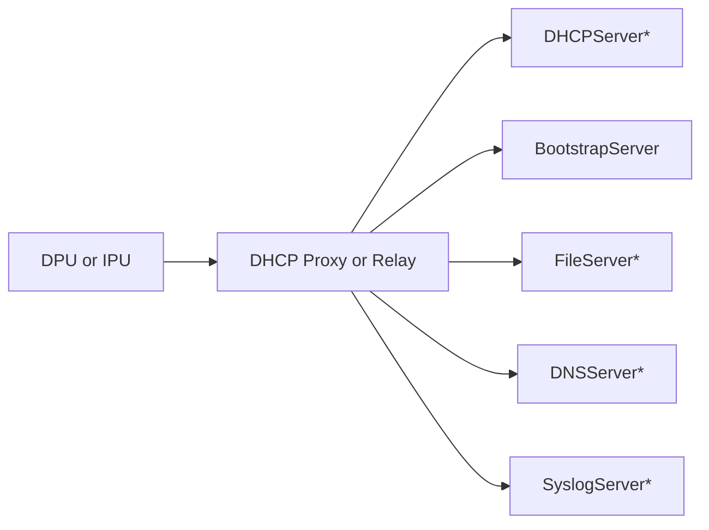
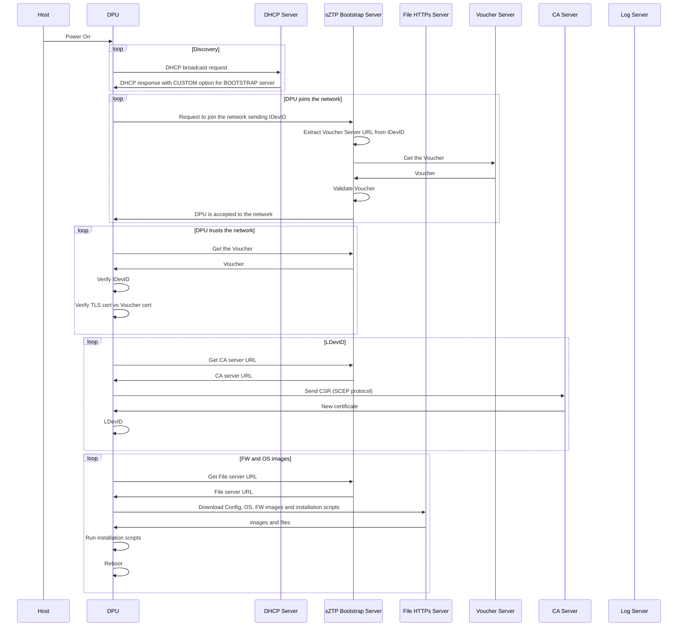

# Secure Zero Touch Provisioning (sZTP)

Passive reprovisioning is a process where DPU or IPU devices  start up and detect that they need to be re-provisioned. One such example might ostensibly be a DPU or IPU being fresh out of the factory and lacks an initial OS.

## What is ZTP

Zero Touch Provisioning (ZTP) allows you to provision new DPU or IPU devices in your network automatically, with minimal manual intervention. This includes system software, operating system, patch files, and configuration files.

You can use either management ports or network ports, depending on your device, to connect to the network.

ZTP solves deploy at scale and reduce labor cost of manual intervention.

## What is sZTP

see <https://www.rfc-editor.org/rfc/pdfrfc/rfc8572.txt.pdf>

Secure Zero Touch Provisioning (SZTP) adds a bootstrap server to DHCP-based ZTP deployment scenarios and uses two-way authentication and data encryption to secure ZTP data.

## Security Considerations for ZTP

- DPU/IPU Validation
  - Network (bootstrap server) must validate DPU/IPU certificates before offering it any artifacts
  - This prevents rougue unauthorized devices connecting to the network
- Network Validation
  - DPU/IPU must validate Network (bootstrap server) that offers artifacts
  - This prevents wrong devices shipped to wrong customers or stolen devices
- Artifacts Validation
  - Every artifact, downloaded during the sZTP process, must be validated for authenticity

## Auxiliary RFCs

- The main RFC we following here is ["Secure Zero Touch Provisioning (SZTP)"](https://www.rfc-editor.org/rfc/pdfrfc/rfc8572.txt.pdf)
- The first part of security considerations, "DPU/IPU Validation" is done using [IEEE 802.1AR - Secure Device Identity](https://ieeexplore.ieee.org/stamp/stamp.jsp?tp=&arnumber=8423794)
  - An Initial Device Identifier (IDevID) is burned during manufactoring process by DPU/IPU Manufacturer/Supplier in the protected immutable area
  - IDevID usually includes PID and Device Serial Number
  - Locally Significant Device Identifiers (LDevIDs) are created during the device onboarding by the DPU/IPU Owner
  - IDevID is offered to the Bootstrap server during onboarding, then Bootstrap server challanges the IDevID to prove device identity
  - See more details below
- The second part of security considerations, "Network Validation" is done using [A Voucher Artifact for Bootstrapping Protocols](https://www.rfc-editor.org/rfc/pdfrfc/rfc8366.txt.pdf)
  - This process helps establishing ownership of the device
  - Device shipped from manufactoring but now "owned" by the customer
  - Customers will add it's "owner" certificate to the protected immutable area to accomplish that ownership transfer
  - Ownership Voucher will be signed by Vendor (Manufacturer) that will allow device to verify and accept OV and burn it
  - RFC 8366 explain all this in more details

## Components of ZTP deployment

- DPU or IPU device: new shipped device that is physically connected and powered but missing config and needs provisioning. Runs sZTP agent/client and uses DHCP client for deployment.
- DHCP server (optional): allocates a temporary IP address, default gateway, DNS server address, and bootstrap server IP or URL to the device to be deployed using sZTP. Some customers don't use DHCP, so either mDNS or static IP address allocation is applied.
- DHCP relay agent (optional): needed only when device and DHCP server are located on different network segments.
- Bootstrap server: Main server in sZTP deploy process. Responsible for mutual validation/trust first. Then sends File Server IP and Image URLs to the device to download in a secure way.
- Deployment file server (optional): can be co-located with bootsrap server, but for scalability (maybe with load balancer) should be separate. Holds deploy image files and config files that devices can download securely (HTTPS) after redirection from Bootsrap Server.
- DNS server (optional): maps domain names to IP addresses (for example bootstrap server and Deployment file server IPs).
- Syslog server (optional): holds/collects logs during the sZTP process.

## Requirements

- Both IPv4 and IPv6 DHCP discovery and ZTP provisioning should be supported.
- For environments that are predominately IPv6 based, we'll need a solution that supports SLAAC.
- ZTP process and results, both success and failures, must be logged.
- DHCP is untrusted, only used to point to Bootstrap server.
- Device must trust network and network must trust device.
- Need image authenticity in addition to onboarding-info authenticity.
- TBD

## Configuring Bootstrap server for Secure ZTP (SZTP)

Those steps will also help to understand the sZTP process from the network/system *admin* perspective.

- Install and start Bootstrap server (assuming DHCP and HTTP are already upo and running)
- Upload IDevID certificate (*TBD: explain more*)
- Upload "Owner Certificate" (*TBD: explain more*)
- Upload device configuration files (config, pre-config, post-config)
- Upload device software images
- Add device Serial Number and "Ownership Voucher"
- Create a profile AKA "conveyed-information" comnbining all the above (device configuration files and software images)
- Add device entry on DHCP server (option 143 - sztp-redirect)

## Device bootsraping before sZTP

- OPI is *not* mandating any specific method to bring the inital image on the DPU and IPU devices
- There are several options that can be utilized, as an example, to help define the scope:
  - Pre-installed image from the factory with sZTP agent present (can be old)
  - Network boot methods (for example HTTPs from UEFI) for the volatile image with sZTP agent present
- sZTP agent will always start running on device boot
- In case sZTP process is disabled or already happened, sZTP agent will exit

## sZTP process

### Discovery

Note: DHCP is completely *untrusted* in this flow, we are not going to secure that, it is just used to point to the Bootstrap server URL.

Note: DHCP is *not* the only option for discovery. mDNS, SLAAC and others can also be supported as part of sZTP by some devices.

Note: When sZTP is enabled, other DHCP options (except defined in the RFC, code 136,143) are *ignored*.

- Device is powered on
  - Question: how? BMC ? Always on?
- Device runs DHCP client to send a DHCP request packet to the DHCP server.
  - Question: DHCP client runs from Linux or from UEFI ?
  - Question: Is DHCP can be assumed ? What else mDNS? Static IP ? Mac ?
  - Question: Is DHCP relay required ? in case we are on the different network ?
- DHCP server assigns an IP address, a default gateway, and the IP address or domain name of the "Bootstrap Server" to the device.
  - Need new custom DHCP option for OPI (similar to SONiC)
  - Question: is "Bootstrap Server" in the cloud ? local in datacenter ? remote ? vm/container ?
  - Comment: probably need to support multiple preferences by operators. some facilities have to be actually local, other can be proxied to a centralized location, others yet can be completely centralized without a local presence.
- Need to consider mDNS as another option if DHCP is absent.
- Need to consider LLDP/SSDP as well.

#### Re-Provisioning

Should there be a ztp setting that automatically goes back into ZTP mode if the network changes? So if you do an initial ZTP and are on 192.168.1.0/24 but then you are unplugged and plugged back in and your DHCP shows you 10.0.0.0/24, ZTP automatically assumes the DPU or IPU  has been either sold, moved datacenters, reprovisioned, etc and retriggers ZTP?

#### DHCP Options

The following are the DHCPv4 options used for Network Boot and Secure ZTP

Note: When sZTP is enabled, other DHCP options (except defined in the RFC, code 136,143) are *ignored*.

|   DHCP Option | Name                 | Description                                                                                                                |
| :-----------: | :------------------- | :-------------------------------------------------                                                                         |
|            60 | class-identifier     | Class Identifier (RFC 2132) (PXE) (HTTP(s)) (i.e. "PXEClient:Arch:xxxxx:UNDI:yyyzzz", "HTTPClient:Arch:xxxxx:UNDI:yyyzzz") |
|            61 | client-identifier    | unique identifier (RFC 2132, RFC 4578) (PXE) (HTTP(s))                                                                     |
|            66 | Server-Name          | TFTP Server Name (RFC 2132) (PXE)                                                                                          |
|            67 | Bootfile-Name        | Boot File Name (RFC 2132) (PXE) or Boot URI (HTTP(s))                                                                      |
|            77 | user-class           | User Class Information (RFC 3004)(i.e. "iPXE", "SONiC-ZTP")                                                                |
|            93 | Client-System        | Client System Architecture (RFC 4578) (PXE) (IA x86 PC, x86 EFI boot, x64 EFI boot)                                        |
|            94 | Client-NDI           | Client Network Device Interface (RFC 4578) (PXE)                                                                           |
|            97 | GUID                 | Globally Unique Identifier (RFC 4578) (PXE)                                                                                |
|           143 | SZTP-Redirect        | (optional) Bootstrap server list (RFC 8572)                                                                                |

The following are the DHCPv6 options are used Network Boot and Secure ZTP

| DHCPv6 Option | Name                 | Description                                                                                  |
| :-----------: | :------------------- | :-------------------------------------------------                                           |
|            15 | user-class           | User Class Information (RFC 3004, RFC 8415) (i.e. "iPXE", "SONiC-ZTP")                       |
|            16 | vendor-class         | Vendor Class Option (RFC 8415) (i.e. 343:"HTTPClient:Arch:xxxxx:UNDI:yyyzzz")                |
|            59 | boot-file-url        | The URL for the boot file (RFC 5970)                                                         |
|            61 | Client-System        | Client System Architecture (RFC 5790,RFC 4578) (PXE) (IA x86 PC, x86 EFI boot, x64 EFI boot) |
|            62 | Client-NDI           | Client Network Device Interface (RFC 5790,RFC 4578) (PXE)                                    |
|           136 | SZTP-Redirect        | (optional) Bootstrap server list (RFC 8572)                                                  |

### Network trusts xPU

Note: "DPU/IPU Validation" is done using [IEEE 802.1AR - Secure Device Identity](https://ieeexplore.ieee.org/stamp/stamp.jsp?tp=&arnumber=8423794)

- Device establishes an HTTPS connection with the "Bootstrap Server"
  - Question: using what certificates?
  - Question: what about QUIC?
  - For environments that are predominately IPv6 based, we'll need a solution that supports SLAAC.
  - More info is here <https://github.com/opiproject/opi-prov-life/blob/main/doc/Zero-Touch-Provisioning%E2%80%94Approaches-to-Network-Layer-Onboarding.pdf>
- Device sends a request to a "Bootstrap Server" to join the network by providing its IDevID.
- "Bootstrap Server" decides to accept debvice to the network or reject
  - Needs trust anchor of IDevID
  - Takes "Voucher Server" URL from IDevID
    - <https://www.rfc-editor.org/rfc/pdfrfc/rfc8366.txt.pdf> (A Voucher Artifact for Bootstrapping)
  - Fetches Voucher with trust anchor of IDevID inside the voucher
  - Verifies IDevID and accepts Device to the network

### xPU trusts network

Note: "Network Validation" is done using [A Voucher Artifact for Bootstrapping Protocols](https://www.rfc-editor.org/rfc/pdfrfc/rfc8366.txt.pdf)

- Device has to decide to trust/join the network now
  - Device asks "Bootstrap Server" to give a Voucher
  - Device starts Voucher verification
    - Device verifies the signature of the voucher
    - Device verifies IDevID from the Voucher belongs to the device
    - Device verifies the correctness of the network by comparing Voucher network root certificate to TLS certificate from the initial connection to the "Bootstrap Server"
  - Device trusts the network now
- Device needs LDevID (crypto identity in the local domain)
  - Device asks "Bootstrap Server" to get "CA Server" address
  - Device generates keypair and CSR
  - Device sends CSR to "CA Server" (SCEP -Simple Certificate Enrollment Protocol)
  - "CA Server" returns certificate to the Device
  - Device has now cryptograhic identity in the local domain

### FW and Config and OS images

- Bootstrap server can/should point to deployment file server
  - for operational and scaling purposes they should probably be separate.
  - There are some scaling requirements on the deployment file server where the implementation details can really drive the pattern of redirection between boot and deployment file servers (for instance, you can avoid having to deploy a load balancer in front of deployment file servers by the boot server spreading the load over multiple DNS names).
- Device performs one-two-three-way authentication with the deployment file server and establishes an HTTPS connection with the deployment file server
  - Question: same as above
- Device downloads the system software, configuration file, and so on...
  - Question: bootstrap server can point to deployment file server? or they are the same?
- Device reboots into newly installed software
  - Question: if the version is the same, can the entire process skip ? where this happens?

Do we want to favor UEFI methods (like HTTPS boot) over others that require a client running in an OS, or a BMC (like sZTP)?

Two overarching scenarios:

1) private network; security provided by physical isolation
2) multi-tenant environment; mutual authentication with device and provisioning server will be essential

## sZTP Configuration

This section shows what ZTP commands are supported on DPUs or IPUs:

- `ztp status --verbose`
  - Use the verbose option to display more detailed information.
  - Agent/Service run status
  - Agent/Service run version
  - Completion status / failures
  - DHCP interfaces and options
  - times (start and run)
  - File downloads status
  - Mutual trust verification status (i.e iDevID and Vouchers)

- `ztp enable`
  - By default ZTP is on, use this comamnd if you disabled the service manually.

- `ztp disable`
  - Stop and Disable the ZTP service. If the ZTP service is in progress, it is aborted (SIGTERM)

- `ztp run`
  - Use this command to manually restart a new ZTP session

## Progress / Monitoring / Debugging

- sZTP should have an option to be started in advanced debug mode to produce more verbose information on steps being performed.

- Monitoring/Status of provisioning incliudes for each device:
  - Starting and ending times of ZTP process.
  - Lists of bound and unbound DHCP client interfaces.
  - DHCP options that DHCP servers send to DHCP clients.
  - Logs indicating which interfaces are used for ZTP.
  - ZTP parameters that DHCP clients obtain from DHCP servers.
  - Filenames of configuration and image files, names of file servers, protocols used to fetch files, and times when DHCP servers fetch configuration and image files.
  - Complettion of both Mutual Trust Authentications (i.e iDevID and Vouchers) and resons for failure.
  - Failure states caused by files not being on servers, or unreachable servers, and time outs.
  - Number of attempts made, and number of attempts remaining, for retry in current ZTP cycle.
  - Completion of file transfers.
  - Installation, reboot, and state of ZTP process.
  - Internal state errors and termination of ZTP process.
  - Logs for when default routes were added or deleted.

Question: how this is implemented and integrated with existing provisioning services?
Question: OPI can produce an agent (container) that runs on DPU or IPU for example and collects all this information via redfish, ipmi, lspci, and other specialized tools... And then exposes single common endpoint API so everybody can query it... like MAAS, JESP, RHEL SAAS and so on...

## Testing

will be tested part of [POC](https://github.com/opiproject/opi-poc/tree/main/integration/pxe)

## What OPI produces?

- OPI can produce secure provisioning server/vm/container that follows some well defined SPEC
- Any other implementation of the secure provisioning server/vm/container is also acceptable if follows same SPEC
- xPU vendors will adopt their implementation to meet this secure provisioning server/vm/container
- Provisioning companies/customers will use API defined to the secure provisioning server/vm/container to integrate in their existing provisioning methods
- Another option would be to actually implement a generic *client* to consume this SPEC/protocol and facilitate provisioning. Obviously there will be parts of the provisioning process that are propiertary, but surely most of it can be vendor-agnostic, based on the spec.

- OPI can also produce an agent (container/service) for Standard Inventory Query that everybody (existing provisioning systems) can query

what is the adoption rate of UEFI on DPUs or IPUs? Should it be relied upon?

## TBD

tbd
